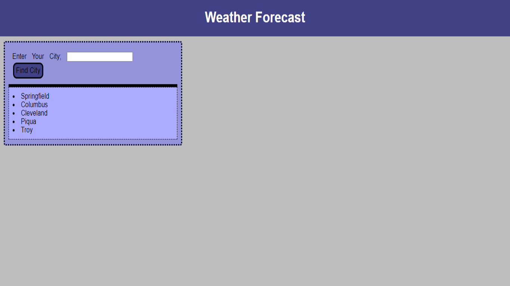
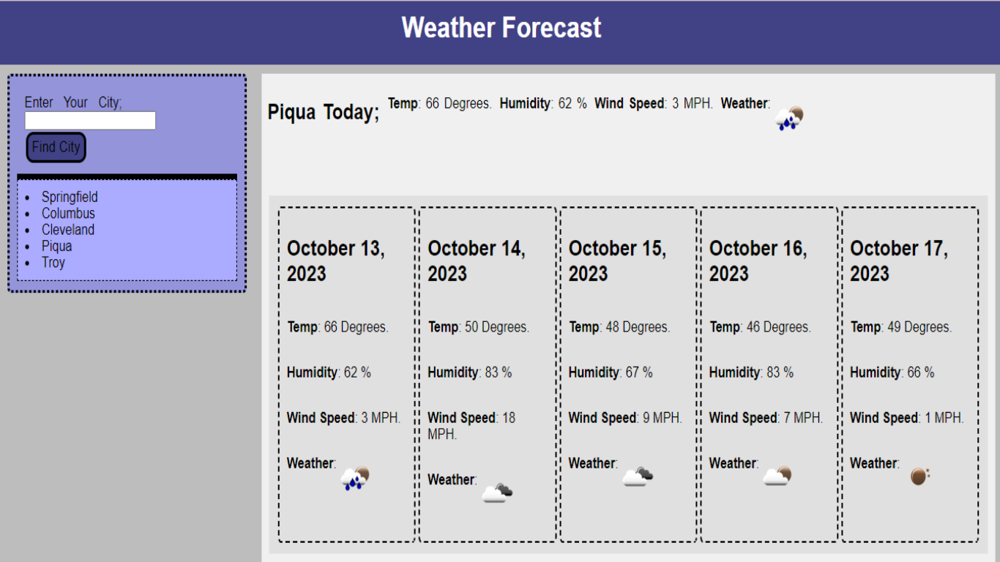

# Weather Alert

## Description

With this app, I wanted to show what we've learned to apply an API to a web page where one could enter a city and find the weather for the next five days. I also have implemented a feature so that the search history is saved by local storage, and appears on the page in the form of a history list. Clicking on these search history list items will allow the page to show the city's weather again as if they had been searched.

## Table of Contents
- [Installation](#installation)
- [Usage](#usage)
- [Credits](#credits)

## Installation

To install this code use `git clone` to clone the repository, `git status` to make sure your copy is up to date or `git pull` to update it.

## Usage

To use this webpage, deploy it here [LINK](https://kc-nick.github.io/weather-alert/), and you can find the Github Repository here [LINK](https://github.com/KC-Nick/weather-alert). This app should appear as the screenshot below, before a search;  and when a search is entered, it will appear as such; 

## Credits

I would like to give credit and thanks to my wonderful instructor, and tutors. I appreciate all the help in learning and growing in my craft!